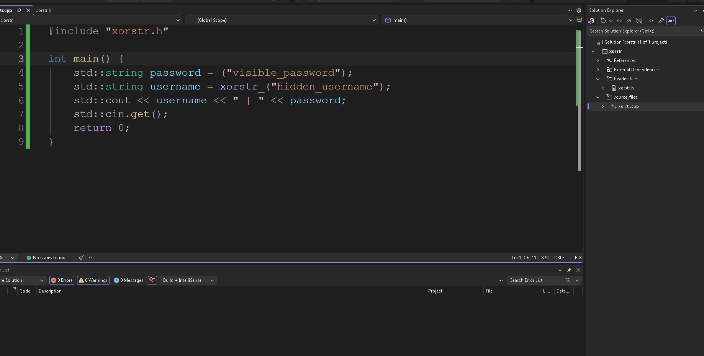

# xor-encryption

Uma **implementação básica** de criptografia de strings em tempo de compilação.

## Sobre o Projeto
Este projeto demonstra o funcionamento prático de ofuscação e criptografia de strings em tempo de compilação, impedindo que textos fiquem expostos nas seções de dados do binário.

## Demonstração
Abaixo, a comparação mostrando o comportamento da string comum versus a string protegida com a macro `xorstr_` ao analisar o executável:

